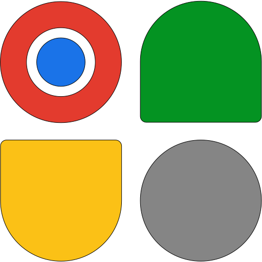

### Hi there 👋

Hi! My name is **Hang Zou**.  
A chef from China.  
The chief chef.


<!--START_SECTION:waka-->

```txt
TypeScript   13 hrs 35 mins  █████████████████▓░░░░░░░   70.20 %
Vue.js       2 hrs 33 mins   ███▒░░░░░░░░░░░░░░░░░░░░░   13.20 %
JSON         1 hr 11 mins    █▓░░░░░░░░░░░░░░░░░░░░░░░   06.17 %
JavaScript   39 mins         █░░░░░░░░░░░░░░░░░░░░░░░░   03.43 %
Markdown     26 mins         ▓░░░░░░░░░░░░░░░░░░░░░░░░   02.32 %
```

<!--END_SECTION:waka-->

## unocss works

<div style="display: flex; gap: 16px">
  
  
  
</div>

### Support me

Think I'm doing a good job? [爱发电](https://afdian.net/@zouhangsweet)
