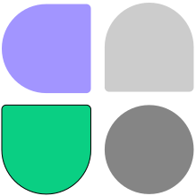

### Hi there 👋

Hi! My name is **Hang Zou**.  
A chef from China.  
The chief chef.


<!--START_SECTION:waka-->

```txt
TypeScript   11 hrs 40 mins  ████████████████████░░░░░   80.44 %
Vue.js       1 hr 8 mins     ██░░░░░░░░░░░░░░░░░░░░░░░   07.87 %
JSON         26 mins         ▓░░░░░░░░░░░░░░░░░░░░░░░░   03.01 %
YAML         23 mins         ▓░░░░░░░░░░░░░░░░░░░░░░░░   02.74 %
CSS          20 mins         ▓░░░░░░░░░░░░░░░░░░░░░░░░   02.31 %
```

<!--END_SECTION:waka-->

## Unocss works

<div style="display: flex; gap: 16px">
  <a href="https://uno-ext-releases.zouhangoo7241.workers.dev/" style="text-decoration: none;">
    
  </a>
  <a href="https://github.com/fisand/unocss-preset-shadcn" style="text-decoration: none;">
    
  </a>
  <a href="https://www.figma.com/community/plugin/1309119336695586856/to-unocss" style="text-decoration: none;">
    
  </a>
</div>

### Support me

Think I'm doing a good job? [爱发电](https://afdian.net/@zouhangsweet)
